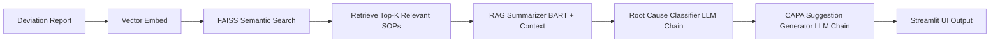

# CAPA Deviataion Reasoning Agent

**LLMs + LangChain + LangGraph+ RAG + Agentic AI for CAPA Reasoning**


# CAPA Reasoning Agent – AI-Powered Deviation Analysis

**A domain-aware, retrieval-augmented agent for analyzing pharmaceutical/biotech deviation reports and recommending structured CAPA (Corrective and Preventive Action) plans.**

---

## Overview

This project delivers an **AI-powered agent** designed to:

* **Parse unstructured deviation reports**
* **Summarize key incidents** with LLM-augmented retrieval
* **Classify root causes** combining domain logic and AI
* **Generate actionable CAPA suggestions** (Corrective + Preventive)
* **Ground outputs via RAG** using an enterprise SOP knowledge base

Built with:

* HuggingFace Transformers (`facebook/bart-large-cnn`, `all-MiniLM-L6-v2`)
* FAISS + SentenceTransformers for semantic document search
* LangChain & LangGraph for modular AI workflow orchestration
* Streamlit for rapid prototyping and UI

---

## Why This Matters

Deviation and CAPA management is **mission-critical in regulated life sciences environments**. Conventional workflows suffer from:

* Manual, error-prone report analysis
* Reactive CAPA formulation with limited traceability
* Lack of contextual grounding in historical data and SOPs

This agent provides:

* **AI-driven root cause reasoning with explainability**
* **Summarization contextualized by enterprise documents**
* **Alignment with GMP/GxP compliance frameworks**

It mimics a **skilled quality analyst’s thought process** — but delivers insights with machine speed, scale, and consistency.

---

## Features

| Module               | Purpose                                                                   |
| -------------------- | ------------------------------------------------------------------------- |
| `document_reader.py` | Reads and preprocesses uploaded deviation text                            |
| `rag_index.py`       | Builds and queries vector store for RAG retrieval                         |
| `chains.py`          | Defines LLM chains for summarization, classification, and CAPA suggestion |
| `langgraph_capa.py`  | Orchestrates AI workflow graph (LangGraph)                                |
| `main.py`            | Streamlit app integrating all components                                  |

---

## Example Workflow

1. User inputs a deviation report (plain text)
2. **Summarization** via retrieval-augmented generation (RAG)
3. **Root cause classification** into categories like *Human Error*, *Equipment Failure*, etc.
4. **Generation of CAPA suggestions** for corrective and preventive actions
5. Display of structured output in Streamlit UI

---

## Architecture Diagram




---

## File Structure

```
capa_deviation_reasoning_agent/
│
├── data/                     # Example deviations & SOP documents
├── tools/
│   ├── document_reader.py    # File loading/parsing logic
│   ├── rag_index.py          # Vector store build/load + retrieval
│   ├── chains.py             # LLM chains (summarize, classify, suggest)
│   ├── langgraph_capa.py     # LangGraph workflow definition
├── main.py                   # Streamlit app entry point
├── requirements.txt
└── README.md
```

---

## 🚀 Installation (with Docker)

We now use Docker to simplify setup and avoid dependency issues. This ensures consistency across all environments.

### ✅ Prerequisites

* [Docker Desktop](https://www.docker.com/products/docker-desktop/) installed and running on your machine
  (macOS, Windows, or Linux — all supported)

---

### 🛠️ Build the Docker Image

From the root of the project:

```bash
docker build -t capa-reasoning-agent .
```

---

### 🔑 Set Your OpenAI API Key

You can pass your OpenAI API key securely as an environment variable when running the app.

**Option 1: Pass directly in terminal**

```bash
docker run -p 8501:8501 \
  -e OPENAI_API_KEY=sk-...yourkey... \
  capa-reasoning-agent
```

**Option 2: Use a `.env` file (recommended for dev)**

1. Create a `.env` file in the project root:

   ```
   OPENAI_API_KEY=sk-...yourkey...
   ```

2. The app will automatically load this using `python-dotenv`.

---

### 🌐 Access the App

After the container starts, open your browser and go to:

[http://localhost:8501](http://localhost:8501)

---

Let me know if you want a `docker-compose.yml` version or development tips (like auto-reloading on code changes).


---

## Skills Demonstrated

* LLM prompt engineering and chaining
* Retrieval-Augmented Generation (RAG) using FAISS and SentenceTransformers
* Hybrid agentic reasoning with rule-based and LLM pipelines
* Domain-specific design for GxP/QMS compliance environments
* Streamlit app development for interactive UX
* Dockerized deployment for consistent, portable, and dependency-free setup

---

## Future Enhancements

* Replace heuristic root cause classifier with fine-tuned transformer model (e.g., DeBERTa)
* Human-in-the-loop feedback to improve CAPA quality and validation
* Deployment with LangChain agents and embedding servers for scalable RAG
* Versioned CAPA templates export (XML, CSV) for ERP/QMS integration

---

## Maintainer

**Maryam Jameela**
AI Scientist & Engineer | Applied Machine Learning Specialist

---

If you want, I can help draft the `requirements.txt` or deployment instructions next!
